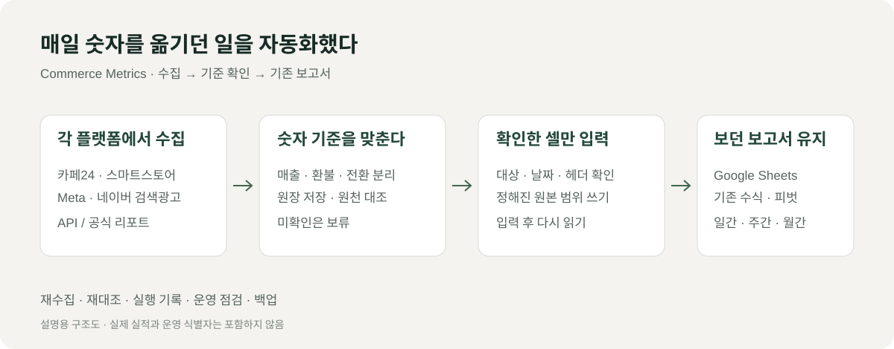

# Commerce Metrics

**매일 숫자를 옮기던 일을 자동화했다.**

커머스 브랜드를 운영하면서 매출과 광고비를 확인하려면 카페24, 스마트스토어, Meta, 네이버 검색광고를 각각 열어야 했다. 확인한 숫자는 다시 Google Sheets에 옮겼다. 매일 하는 일인데, 빠뜨린 날짜가 있거나 숫자가 맞지 않으면 같은 화면을 다시 찾아야 했다.

이 과정을 줄이려고 Commerce Metrics를 만들었다. API로 데이터를 가져오고, 기존 보고서가 읽는 원본 셀에 연결했다. 만드는 동안 가장 많이 확인한 건 **이 숫자를 그대로 넣어도 되는가**였다.

## 숫자를 가져오기 전에 기준부터 맞췄다

같은 매출이라는 이름이어도 플랫폼마다 집계 날짜와 금액 구성이 달랐다. 주문에서 계산한 금액이 관리자 화면과 바로 일치하지 않는 경우도 있었다. 광고에서 잡힌 전환매출은 실제 판매매출과 따로 봐야 했다.

그래서 플랫폼별로 기준을 정하고, 같은 기간의 관리자 수치와 대조했다. 아직 확인하지 못한 값은 비워 두었다. API가 값을 돌려줬다는 이유만으로 보고서에 넣지는 않았다.

| 확인한 문제 | 반영한 방식 |
|---|---|
| 판매매출과 광고 전환매출이 섞임 | 서로 다른 지표로 저장하고 집계 |
| 결제·환불·추가 결제의 날짜와 의미가 다름 | 사건별로 기록하고 확인한 기준으로 합산 |
| 광고 구매 지표가 여러 이름으로 반환됨 | 같은 구매를 중복 합산하지 않도록 정규화 |
| 전체 전환을 구매 전환으로 볼 수 없음 | 구매 기준이 확인된 지표만 사용 |
| 조회 실패와 실제 0이 구분되지 않음 | 누락·미확인은 빈 값과 보류 상태로 유지 |

[숫자 기준을 맞춘 과정 →](case-studies/metric-definitions.md)

## 기존 보고서는 계속 쓰게 했다

매일 보던 일간·주간·월간 보고서를 새로 만들고 싶지는 않았다. 보고서의 수식과 피벗은 유지하고, 필요한 원본 값만 자동으로 채우는 방향으로 잡았다.

쓰려는 시트와 탭, 날짜, 헤더, 허용 열을 먼저 확인한다. 입력 계획을 만들고 검증한 뒤 정해진 셀에만 쓴다. 입력 후에는 다시 읽어서 실제 반영된 값까지 확인한다. 레이아웃이 바뀌거나 대조가 끝나지 않은 값은 보류한다.

[기존 보고서를 유지한 방식 →](case-studies/safe-sheet-writes.md)

## 매일 돌아가는 과정도 만들었다

한 번 수집하는 것과 매일 맡겨 두는 것은 달랐다. 인증 만료, 조회 지연, 나중에 바뀐 실적을 확인할 수 있어야 했다.

전날 수집과 주간·월간 재대조를 나누고, 재시도와 실행 기록을 붙였다. 같은 자료를 다시 가져와도 중복 합산하지 않도록 저장한다. 실패와 보류는 따로 남기고, 운영 점검·알림·백업으로 이어지게 했다.

[재수집과 운영 검증 →](case-studies/recovery-and-validation.md)

## 어디까지 만들었나

2026-09-30 운영 기록을 기준으로 정리했다. 전체 과거 기간이나 모든 플랫폼의 검증이 끝났다는 뜻은 아니다.

| 영역 | 확인한 상태 | 남은 확인 |
|---|---|---|
| 카페24·스마트스토어·Meta·네이버 검색광고 | 핵심 수집, 서버 운영, 최근 운영 시트 입력 기록 확보 | 일부 과거 예외와 원천 독립 대조 |
| GA4·Instagram·Meta 상세 | 운영 연결과 시트 입력 후 재조회 기록 확보 | 표준 커머스 이벤트 점검 |
| 카페24 회원 수 | 권한 연결, 과거 기간 입력과 재조회 확인 | 첫 정시 자동 실행의 별도 확인 |
| 날씨 | 수집·입력 흐름 구축 | 원천 누락은 빈 값으로 유지 |
| 29CM | 공식 파일을 대조해 입력·재조회 | 주문 원천 독립 대조와 일간 API |
| 그 외 타사몰 | 조사·일부 검증 도구 구현 | 공식 자료와 연동 방식 확인 |

수작업으로 옮기던 핵심 경로를 자동 수집과 제한 범위 입력으로 연결했다. 다만 절감 시간과 오류 감소율은 아직 측정하지 않았다. 다음에는 운영 실패 기록과 대조 결과를 쌓아 자동화가 실제로 얼마나 안정적인지 확인하려고 한다.

## 내가 맡은 일

실제 운영에서 필요한 지표와 보고서 구조를 정하고, 플랫폼 숫자를 어떤 기준으로 볼지 판단했다. 우선순위를 잡고, 관리자 화면과 시트에서 결과를 확인하며 수정 방향을 정했다. 코드 구현·테스트·문서 정리에는 AI 도구를 함께 사용했다.

**사용 기술:** Python · SQLite · REST API · Google Sheets API · OAuth · systemd

[전체 구조 →](architecture.md) · [검증 기록 →](validation.md)

공개 자료에는 실제 실적·고객 정보·운영 계정·인증정보를 넣지 않았다. 그림과 예시는 설명용으로 구성했다.
