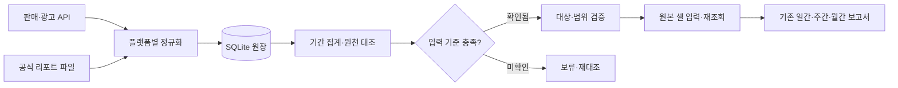

# 데이터가 보고서까지 가는 길

수집기는 플랫폼마다 다르지만, 금액·날짜·사건·완료 상태는 공통 계약으로 다룬다. 저장과 집계, 시트 입력을 나누어 API 응답을 그대로 보고서에 넣지 않게 했다.

| 구성 | 선택한 이유 |
|---|---|
| Python 수집기 | 플랫폼 연결과 반복 수집을 한 도구에서 관리 |
| SQLite 원장 | 재수집·기간 집계·실행 상태를 로컬 데이터로 추적 |
| Google Sheets | 기존 보고서의 수식과 사용 흐름 유지 |
| systemd 서비스·타이머 | 예약 수집·재시도·운영 점검 분리 |
| 합성 응답 테스트 | 실제 계정과 원천 자료 없이 회귀 검증 |

실제 서버 주소, 계정과 시트 식별자는 이 자료에 포함하지 않았다.

[README로 돌아가기](README.md)
