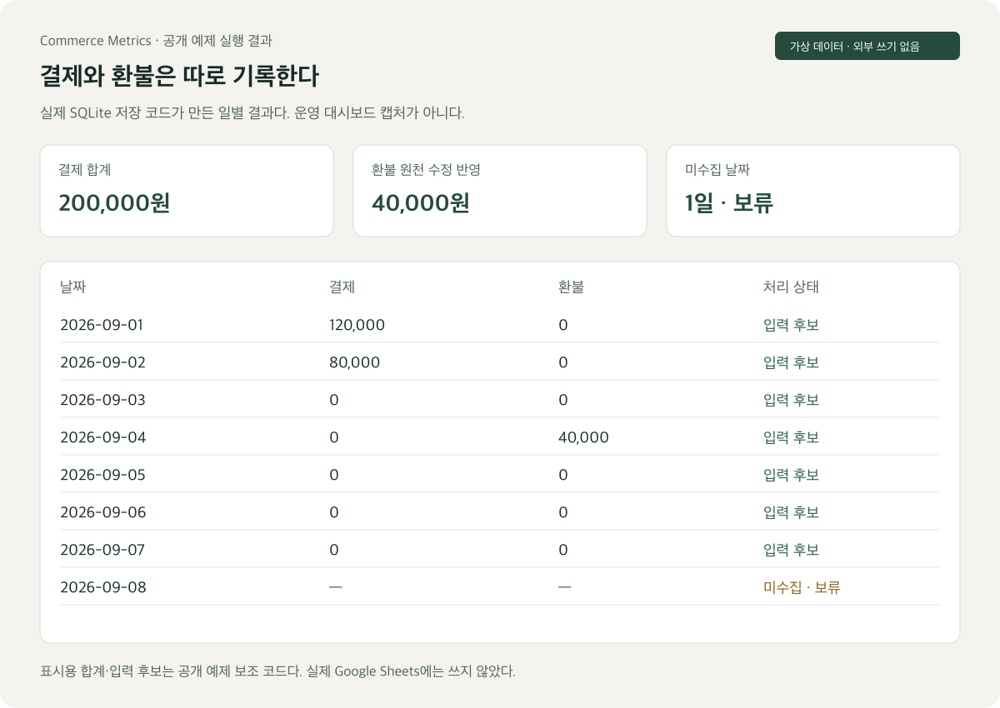
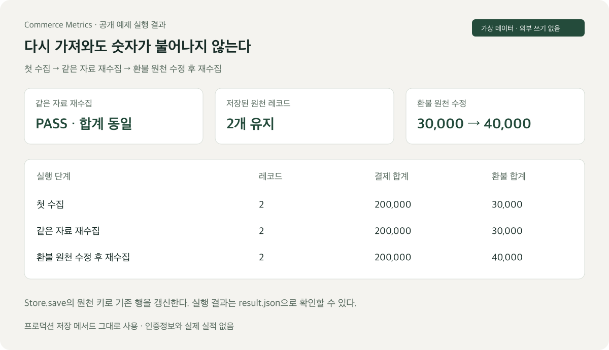
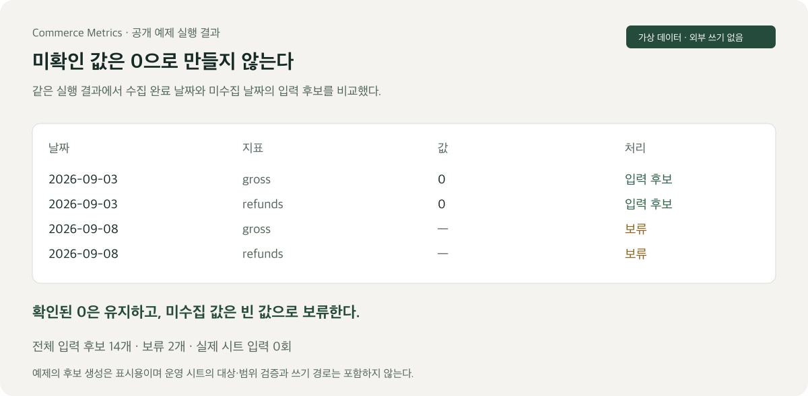

# 숫자가 어떻게 처리되는지 직접 보기

공개한 예제의 실제 실행 결과에서 이미지를 만들었다. 운영 보고서 캡처가 아니며, 값은 모두 가상 데이터다. 실제 저장 메서드와 예제의 표시 코드를 나누어 볼 수 있다.

## 일별 집계



결제와 환불을 별도 사건으로 기록한다. 수집이 완료된 날짜의 실제 0과 수집하지 않은 날짜의 빈 값을 구분한다.

## 같은 자료를 다시 수집했을 때



첫 수집과 같은 자료의 재수집 결과가 동일하다. 원천 레코드는 2개이며 결제 합계는 200,000원으로 유지된다. 환불을 30,000원에서 40,000원으로 바꿔 다시 수집하면 기존 기록을 교체한다.

핵심은 원천 식별자로 기존 행을 갱신하는 코드다.

```sql
ON CONFLICT(brand,platform,account,kind,source_id)
DO UPDATE SET payload=excluded.payload,run_id=excluded.run_id
```

이 구문을 포함한 [Store.save](examples/idempotent-ledger/ledger.py)는 실제 작업본의 메서드다. 원본에서 초기화·저장에 필요한 네 메서드를 변경 없이 추렸다. 화면·합계 표시·입력 후보는 공개 예제의 보조 코드다.

## 미확인 값의 처리



수집 완료 기간의 숫자는 입력 후보로, 미수집 날짜의 값은 보류로 표시한다. 예제는 후보 14개와 보류 2개를 만들었다. 실제 Sheets에는 쓰지 않는다. 운영 시스템의 대상·범위 검증과 원천 대조 자격은 이 작은 예제에 포함하지 않았다.

## 직접 실행

```sh
cd examples/idempotent-ledger
python3 demo.py
python3 -m unittest -v
```

Python 3.9 이상이며 추가 설치나 인증정보가 필요 없다. `report.html`을 내려받아 열면 결과 화면의 세 탭을 볼 수 있다. 코드를 실행하면 같은 위치에 HTML과 JSON이 다시 생성된다.

테스트 5개로 재수집, 나중에 바뀐 환불, 빈 값과 0, 계정·브랜드 분리, 데모·실운영 DB 혼합 차단, 금액·시간대 계약을 확인했다.

[실행 결과 JSON](examples/idempotent-ledger/result.json) · [원본 코드 기록](examples/idempotent-ledger/source-provenance.json) · [프로젝트 소개](README.md)
